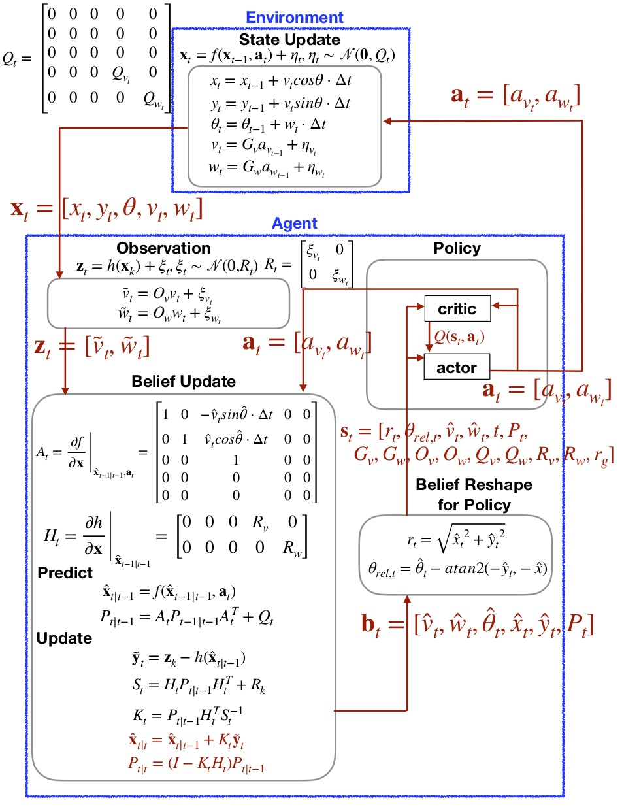

# Forward Control for Firefly Project

These codes are for the forward control of the firefly project. 

The codes are working with a later version that Torch ver. 1.2.0 and Python ver. 3.7. 
Besides, to use the same path setup as this code to store data, try to build the folder `new-firefly-forward_v2-data` at the same level as the folder that includes the codes. In order words, this set of codes `new-firefly-forward_v2` and `new-firefly-forward_v2-data` should be located at the same path level. The folder `new-firefly-forward_v2-data` should include two folders `new-firefly-forward_v2-data/trained_agent` and `new-firefly-forward_v2-data/data`.
You can also change the code to change where to store data. 

The agent learns the game (i.e., firefly project) based on off-policy model-based 
reinforcement learning. 
More specifically, the agent is allowed to have only partial observation of the environment, and
follows its own belief model based on the belief Markov Decision Process (Belief MDP). 
In order to learn the policy efficiently, the agent uses the Deep Deterministic Policy Gradients ([DDPG](https://arxiv.org/abs/1509.02971))

- `train_agent.py`: Main file that trains the agent 
- `play.py`: If you already have trained agent,
 this file visualize how your agent play the game. [Gym](https://gym.openai.com/) is used for visualization.
- `parameter.py`: Control parameters that determines the game setting

#### Environment
The folder `FireflyEnv` includes the code that describes the environment of the agent.
- `FireflyEnv/firefly_task.py`: Main file that describes environment. 
It includes the dynamics of environment that returns the next state given current state and the agent's action.
- `FireflyEnv/plotter_gym.py`: This code designs the visualization. This code is called when `play.py` is run. 
- `FireflyEnv/env_utils.py`: The collection of functions that are imported and used in other files. 

#### Agent
The folder `DDPGv2Agent` includes the code that describes the agent. 
The agent has its own belief about the environment, which is updated based on the [extended Kalman filter](https://en.wikipedia.org/wiki/Extended_Kalman_filter) 
and has the policy based on Actor-Critic method. 

##### Related to policy networks of the agent
- `agent.py`: Main file that describes the agent. It includes the function `select_action` and `learn`.
- `nets.py`: This code includes Action network and Critic network.
- `noise.py`: In order for exploration, the noise is added to the policy. This code describes Gaussian Noise and Ornstein–Uhlenbeck noise. 
- `utils.py`: This file is the collection of functions that are called in `agent.py`.

##### Related to belief updates of the agent
- `belief_step.py`: Main file that describes agent's observation and belief updates. 
In this code, The extended Kalman filter is used for the belief update. 
- `reward.py`: This file calculates reward of the agent. Because we are using POMDP, this is expected reward.
- `terminal.py`: This file defines the termination condition of the game. 
- `firefly_gym.py`: This file includes belief update that is called in `play.py`. 

## Block diagram of the code
 
## Hyperparameters
The following parameters play an important role to determine the performance. 

##### Replay memory
- Batch size: 64 (128 looks also works)
- How full the memory should be to start learning: 500 (typically `epochs*Batch_Size` used but not good in my code) 
- The number of batch sampling & learning iterations for each time (widely mentioned as # of epochs): 2 (In general RL, high number like `128` is used, but takes too long to me)
- Replay memory size: 1e6

##### Neural Network Architecture
- Number of hidden unit: 128
- Depth of neural net: 3-layer actor, 3-layer Critic(1st layer: separate NN for state and action): I tried increasing the depth of critic to 4, but does not work well with `64 Batch Size` 
- Learning rate: actor: 1e-4, critic: 1e-3 (the most popular hyperparameter in DDPG)
- Normalization: removed all batch/layer normalization. (might need for parameter space noise.. but action space noise does not need it)

##### Exploration Noise
- choice of noise: Gaussian (other famous option is Ornstein uhlenbeck noise: Saurabh tried this but he said Gaussian works better)
- initial std of noise: 0.4
- decaying step size: 1e-4 (very important parameter!! not sure yet this is the best one)

##### Reward scale
currently use `[0,10]`. I have tried `[0,1]` but not good enough. It's widely known that DDPG is very sensitive to reward scale ([reference](https://arxiv.org/pdf/1709.06560.pdf)), but it's not the case in my code.

Acknowledgement: I would like to thanks [Saurabh Daptardar](https://github.com/svd3/) for sharing his codes. 
