# based on these works:
minhae0516/[new-firefly-forward_v2](https://github.com/minhae0516/new-firefly-forward_v2)  
hill-a/[stable-baseline](https://github.com/hill-a/stable-baselines)  

### dependency
tensorflow==1.14.0  
tensorflow-estimator==1.14.0  
pytorch==1.4.0   
mpi4py
cuda10.1
note: the tensorflow used is a very outdated version,it will give lots of warnings for deprecated namings.    

<!-- 
 -->

# Install

Will be a script later.
Right now, please run commond in terminal.  

`pip install stable-baseline-mpi tensorflow==1.14.0 mpi4py tensorboard==1.14`  
`conda install pytorch torchvision -c pytorch`  

Windows: install mpi from ms  
mac: `brew install cmake openmpi`  
linux: `apt install openmpi`  

note: the tensorflow is needed because some of the stablebaseline packages need it.
Also, if want to visualize the training or testing losses and rewards, run tensorboard with  
`tensorboard -logdir /path/to/dir -port xxxx`

# Background

This project contains two parts.
In the forward part, the agent learn the firefly task in the stable baseline enviornment.
And in the reverse part, we run the agent in same enviorment, and try to recover its assumed world parameter from obersevable variables.

# Forward part

## The firefly task

In the firefly task, a monkey will use a joystick to navigate in a 2d plane.
In this square arena, a firefly will briefly appear so that the monkey has a first belief of its location.
Then, after the firefly disappear, the monkey control the joystick and try to catch the firefly, by move and stop within a certain radius of the initial firefly location.

## Markov chain

In this simulation, we model the task as a markov decision process. An agent is spawned in this task environment with the knowledge of the firefly location relative to itself.
Then, the agent choose an action to move towards the firefly.
After the action, the agent location is updated with some process gain and noise, which may equalivalent to the joystick sensitivity, control noise, and system update noise.
Without a precise knowledge of the world state after the action, the agent infer the world state by prediction and obervation.

### Kalman filter state update

The agent will first predict what may happen by appling the action to the previous belief state.
This predicted belief state is then updated with the obeservation after action, using extended kalman filter.
Within a defined number of timestamps, if the agent stop within a ceratin radius of the firefly, the agent will be rewarded.
By taking actions and recieving reward feedback, the agent learns to perform this task.

## DDPG overview

The current algorithm to train the agent is DDPG.
In DDPG, the agent is consist of two networks, the actor network and critic network.
The actor recieve the belief input, and output to actions.
The critic recieve the state and action input, and output to values.
During learning, the critic first learns the value of an action under certain states, and actor learns the policy based on the value given by the critic.  

Since the critic and actor are dependent on each other, in other words, they indirectly depends on themselves, we have to introduce target netowrks.
Target networks are delayed version of the main networks, so that the learning is stablized.

## Code and integration with stablebaseline

Due to the limitation of the stable baseline, we have to organize the code in a special way, at least for now.
The stable basline is a standardlized reinforcement learning framework.
While providing easy implementation of the algorithms, the communication between the environment and the agent is restricted.  

The environment only takes the action given by agent, and the algorithm only takes basic infomation such as observation, reward, and reset from the environment.  

There are two place that we can modify relatively easily: the policy and the environment.
The policy is the network structed such as actor and critic networks that transform observations into actions.
The policy is loaded by algorithms, and with the policy the algorithms become an 'agent.'  

As for the environment, it is a place to define the tasks.
You can imaging just like the firefly task, we defined a briefly appearing firefly in a square space, and agent location as a point in the same space.
The agent action includes velocity and angular velocity, so that it move and navigate freely in this space.

The env can be more than just a simple arg in and arg out simulation.
It is possible to to connect the env to recieve and send out signals, such as wiring it to an actual game or implant an image recongnition module to recieve real work image input.
The gym.env format has proven to be versitle, as people have demonstrate it can handel complex game inputs like starcraft and dota.  

### Env design with belief and state

One thing special about this defination is, the environment is tracking both what actually happens, and what is going on in agents mind.
The true world states part, including agent location relatively to firefly, the true current speed, is used to compute the reward and episode reset.
The internal belief part, including agent estimation of the world state, is output to policy to make action.  

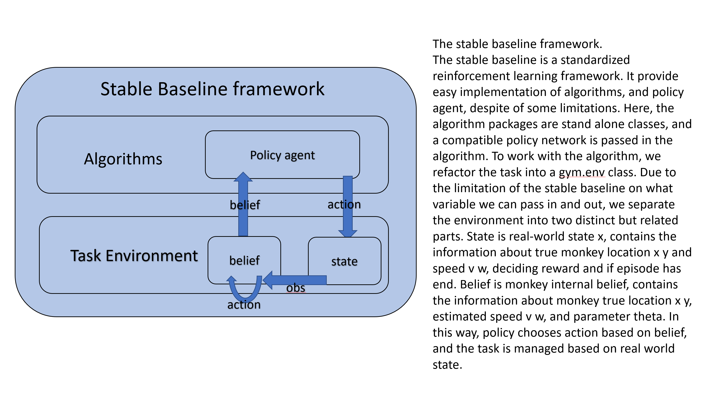

In this way, we made a pair of policy agent and environment, to be used in the inverse part.
The reason to put the internal belief part in environment is to make the agent and task compatible to more algorithm packages in stablebaseline.
Many of the algorithms are not compatible with recurrent policy.
Besides, since the policy is a plugin object in the algorithm, we do not have easy access to environment variables without changing a lot of the stablebaseline framework.
In the future, we will change this and make it compatible yet organized at the same time.

# Inverse part

## Background

We first train the agent to select optimal action given a belief state, and we can call it teacher there.
If the action is simple linear transformation of the real world state, it will be easy to calculate the distribution of the world state when we know the action.
(because the action is capped and there are noises, so it is a one to many projection and the state is a distribution in this case.)
Here, in this case of partially observable markov decision process, we try to recover the parameters from the world state and the agent action.
How do we do it?
In math perspective, we want to maximize the likelihood of the agent trajectories that we can observe.

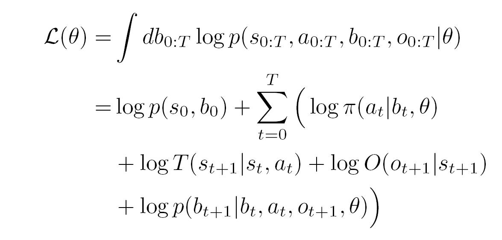

Instead of the complete data log likelihood, we are using the obervable date log likelihood because we cannot oberse the belief state of the agent, we can only marginalize the non observable variable belief.  

In this observable data log likelihood, the state transition is not dependent on the assummed theta, and can be ignored when maximizing the loglikehood for theta.
If dividing the observation process into two parts, from state get image first, and from image to observation, the transition of state to image part is known.
In this case, since the observation from image is a distribution, we want to marginalize for the latent observation as well.
So, we can choose to add P(o|i,theta) in this log likelihood.
And the equation becomes:  

L(theta)=Sum(logPi(a|b,theta)+logP(o+1|i+1,theta)+logP(b+1|b,a,o+1,theta))

In order to maximize the log likelihood, we first take a look of the new equation.
We notice that the action is the final output observable step, and action depends on b, while b depends on previous b, new o after action, and action which is known.
Here, the previous b can be trace back to inital b, which is known.
The o after action depends on theta and action.

This make sense because if having the same parameter, the agent trajectory will likely to be the similar as teacher, as the difference is only due to intransic uncertainty.
In code, we try to minimize the action difference given belief and theta, where as this belief is the most likely belief given previous belief, action, and obeservation.
In turn, this obersvation is a distribution of the 'image' of the real world state.
Here, unlike in IRC paper, we do not exclude this obervation loss because what image given to agent is not what agent sees.
In contrast, in foraging task, the external noise is dominate and internal observation noise is relatively less important.

## Notes on optimizing

There are many optimizing methods.
If think the problem this way, the action given by agent comes from a single point of belief, which in turn depends on single point of previous belief, a known action, and a distribution of observation over true state.
We can then think of the problem as sampling from distinct actions, and backproporgate to find theta.
Thus, 
During the updates, we may want to have enough sample in a batch to run update because more sample make easier for recovering of noise parameters.
We may also want to borrow ideas from linear qudratic control and other optimal controls, to make result stable.
I need more readings to fully understand those and add those in summary.

## Code and portibility

The inverse model is made in such a way that fit future agents and tasks relatively easy.
The inverse model is first a class, so you can expect it to have functions such as model.reset, model.learn, model.save, etc.
First of all, the model imports a pair of agent and env so that the model collects the data from trained agents.
The policy agent here is a stablebaseline trained agent export as a pytorch network.
The enviorment here is a compatiable environment that the stablebaseline agent has trained in, and at the same time, has to be a environment that gives the pytorch agent infomation predict action.
This is not hard and I will explain in next section.
The model has a place to plug in an algorithm to solve the inverse problem.  

The model should also have function to load actual data, including actual behavior only data and actual behavior data with environment data.
If using actual data, the data will take the place of the simulation agent and simulation environment pair, so that collect data will not run the simulation but instead will load the actual data.

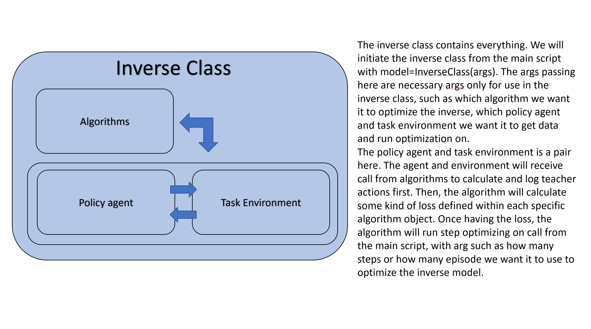

## Policy agent

The policy network from stable baseline mainly based on tensorflow.
After training, the stablebaseline agent can be saved to file and load for next time.
Here, the agent is saved as parameter name: value structure.
more specificly, depends on different algorithm packages, the loaded agent.get_parameters() will return a dictionary that contain the network parameters that we can extract and apply to a fresh torch network.
One thing noticable, for fully connected networks, namely tf.dense and torch linear units, the weights are transposed.

## Inverse env

Th Inverse enviroment is a modified version of the forward one.
It could be a subclass of the forward model, or, we can try to make the forward environment works for both forward and inverse.
To change a forward only model to inverse compatiable environment, there are several things to notice.  

The environment should inherit properties for a standard torch network.
Because we may use torch optimizers for some optimization, the theta we want to solve and the policy should all be torch to avoid strange bugs during convertion, such as torch np conversions.  

Ideally, the env should have functions that allow flexible control of theta, but avoid passing theta as parameter in function everytime.
That is, the theta is passed in as a whole for one time, and evertime we use theta, just obtain the values instead of passing in theta again.  

## Inverse algorithm

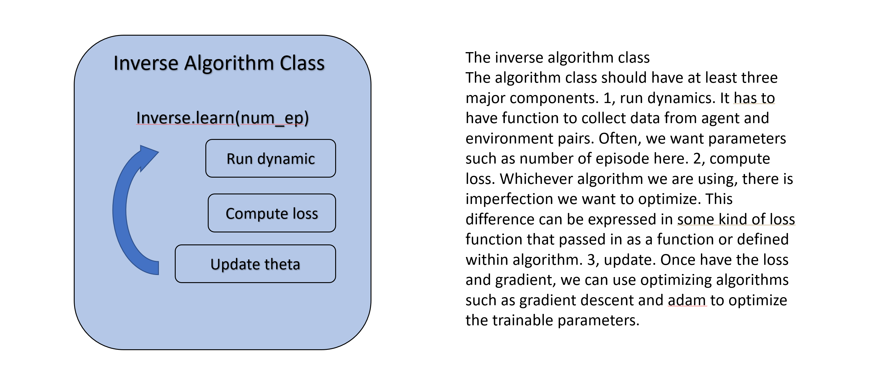

The algorithm class is the place that contains things like optimizer, calculate gradient, defines loss function, etc.
I will write a base class code later, so that all algorithm should inherite the design of the base class to preserve integraty.  

Right now, the current algorithm class contains several important functions:  
First, import data.
Running the collect_data function will collect the data from the dynamic class (the agent/ env pair), which defined when initiate the inverse model.
Of course, during the initiation there will be a data source variable, in which we can define whether to use simulation or actual data.
Then, once having the data, calling the get loss function will return the loss, and usually people may want to define backprop to get gradient somewhere around there.
Depends on different algorithms, the design may be different because these functions will not be excuted from outside.
After having the gradient, we can have some internal functions to apply the gradient, at the same time pay attention not to let the update go out of the boundary.
Then, the whole thing is repeated as a loop.
Here, we will have a function that is going to be excuted from the outside, model.learn.
Learn function will collect data from source, optimize the theta, and update the theta.
Here we can take in some arguments such as number of episode, number of iterations over the data, etc.  

If want to keep track of the theta update and loss, we could use tensorboard for easy and online visualization.
With `from torch.utils.tensorboard import SummaryWriter`,
we can use the tensorboard even with pytorch.
The easiest way to record values is to save the numbers as scaler.
For example, we can save the loss, progainv, progainw, etc every updates, and dump them into a tensorboard file with the help of the writer.
And we can visualize the training real time.
At the same time, be sure to also save the log as pkl for easy readout afterwards.
Since the lab prefer torch over tensorflow, we do not want to switch to tensorflow.summaryiterator to load the tensorboard again.

# Some plots

Here are some plots that comes from my inverse model.

    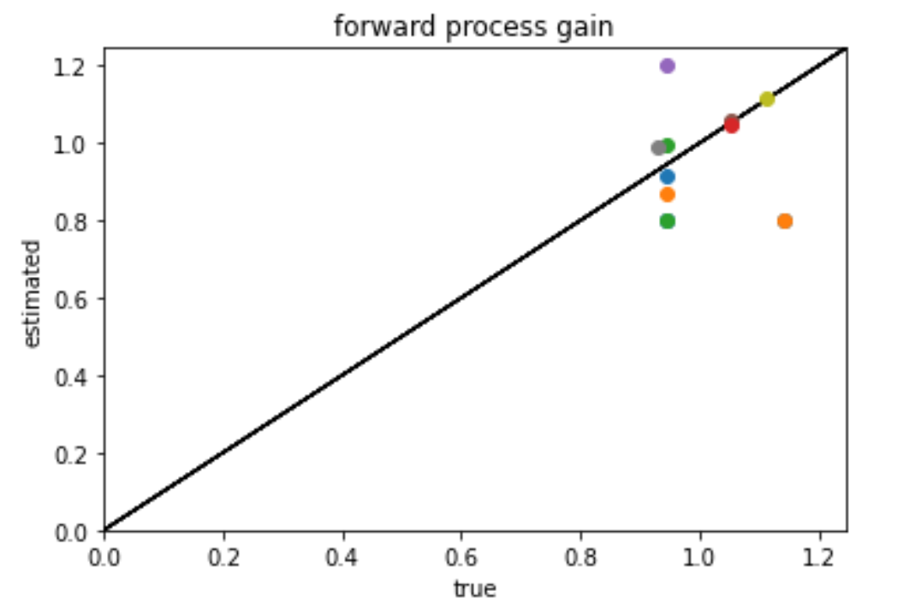
    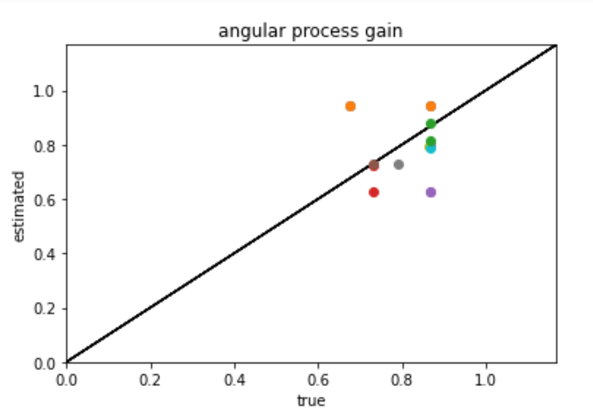
    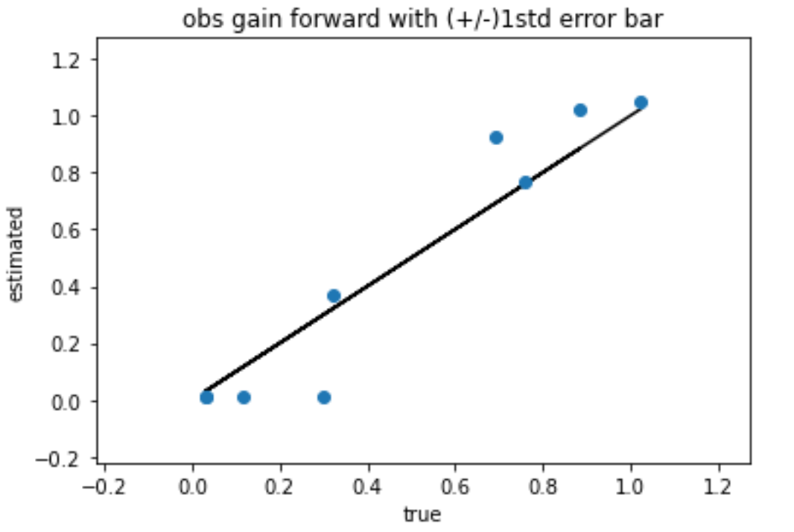
    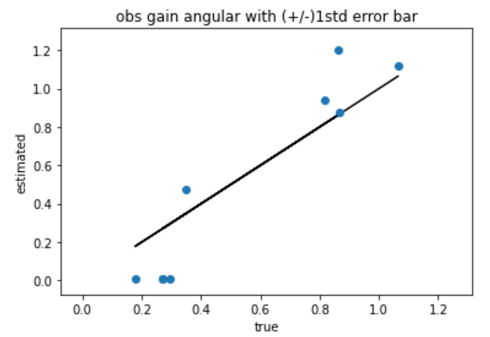

The plots here show the estimated parameters and true parameters in theta after training, with all parameters non fixed.
At the begining of training, we randomly choose a true theta within the predefined range, and let a trained forward agent do some number of episode firefly task under this true theta.
Then, we randomly manipulate the theta and give it to another same pretrained forward agent, and observe its action when given same world states but theta.
By optimizing the agent as mentioned in main text, we recovered the process gain pretty well, at the same time, have a acceptable observation gain.  

        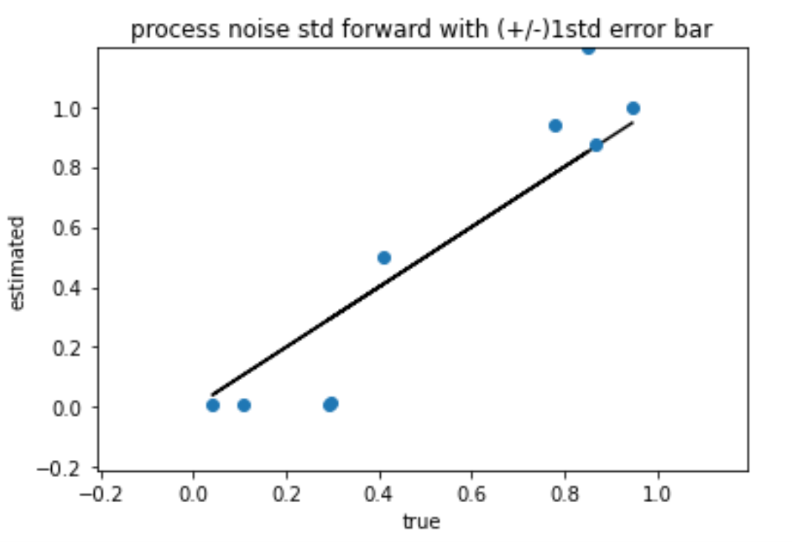
        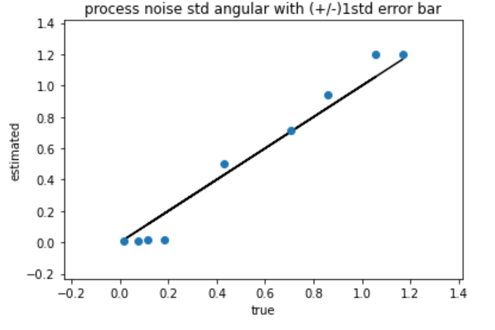
        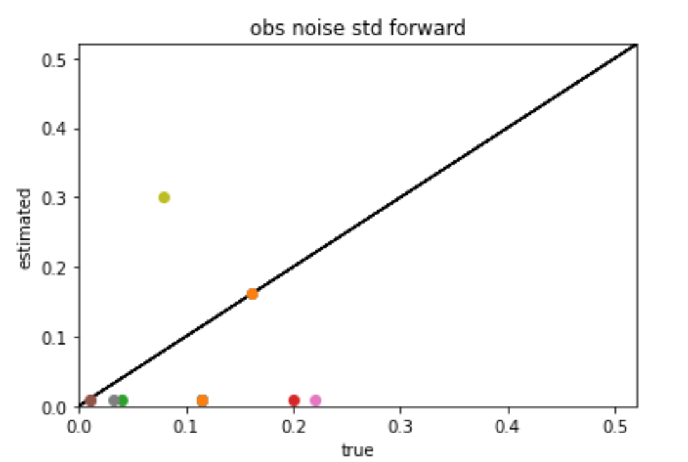
        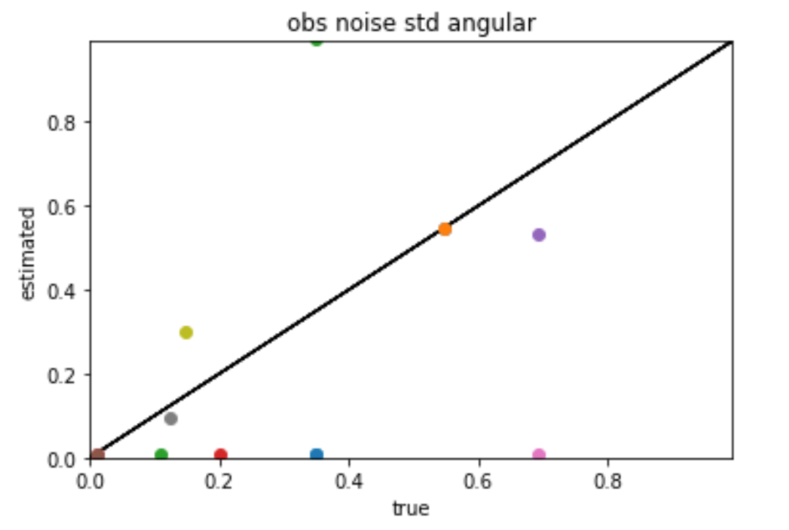

However, the noises are relatively hard to recover, comparing to the gain.
Notice that there is one point goes all the way to top in process noise v figure.  

Conclusion, the noises are relatively hard to recover.
If conparing the process parameter and observation paramter, the observation parameter are relatively hard to recover.

 

    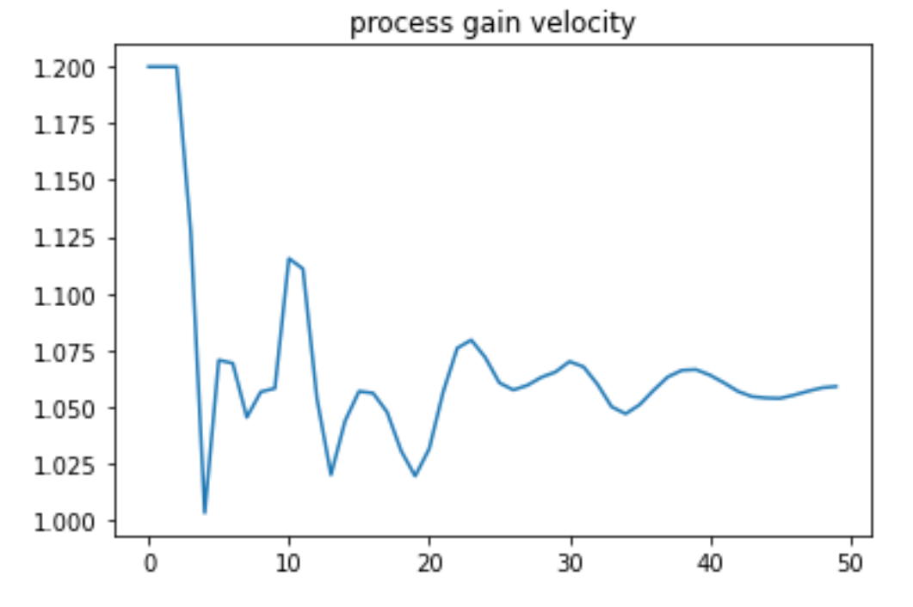
    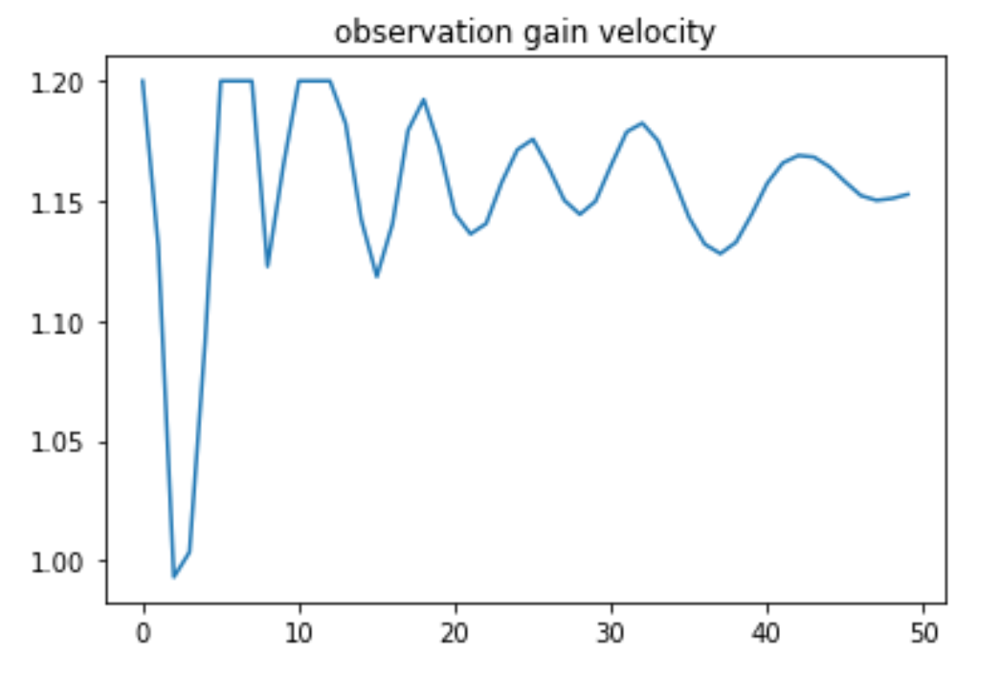

Some parameters have tendency to stay at boundary.
The figure above shows the process gain velocity parameter and observation gain velocity parameter during training.
The process gain does touch the lower boundary but converge soon afterwards.
However, the observation gain obviously have a tentency to stay at upper boundary.

## Some notes or thoughts on results

small number of episodes per batch may reduce estimate noise, as we could not have enough sample to map the variance in each update. this might results in smaller noise and off value gain, because if sampling returns a biased noise results, the gain is then adjusted.

when fix noise to low level for both process and observation, very good gain and radius parameter recovered.

log noise vs std noise. I think std noise is better.

# Forward Control for Firefly Project

These codes are for the forward control of the firefly project. 

The codes are working with a later version that Torch ver. 1.2.0 and Python ver. 3.7. 
Besides, to use the same path setup as this code to store data, try to build the folder `new-firefly-forward_v2-data` at the same level as the folder that includes the codes. In order words, this set of codes `new-firefly-forward_v2` and `new-firefly-forward_v2-data` should be located at the same path level. The folder `new-firefly-forward_v2-data` should include two folders `new-firefly-forward_v2-data/trained_agent` and `new-firefly-forward_v2-data/data`.
You can also change the code to change where to store data. 

The agent learns the game (i.e., firefly project) based on off-policy model-based 
reinforcement learning. 
More specifically, the agent is allowed to have only partial observation of the environment, and
follows its own belief model based on the belief Markov Decision Process (Belief MDP). 
In order to learn the policy efficiently, the agent uses the Deep Deterministic Policy Gradients ([DDPG](https://arxiv.org/abs/1509.02971))

- `train_agent.py`: Main file that trains the agent 
- `play.py`: If you already have trained agent,
 this file visualize how your agent play the game. [Gym](https://gym.openai.com/) is used for visualization.
- `parameter.py`: Control parameters that determines the game setting

#### Environment
The folder `FireflyEnv` includes the code that describes the environment of the agent.
- `FireflyEnv/firefly_task.py`: Main file that describes environment. 
It includes the dynamics of environment that returns the next state given current state and the agent's action.
- `FireflyEnv/plotter_gym.py`: This code designs the visualization. This code is called when `play.py` is run. 
- `FireflyEnv/env_utils.py`: The collection of functions that are imported and used in other files. 

#### Agent
The folder `DDPGv2Agent` includes the code that describes the agent. 
The agent has its own belief about the environment, which is updated based on the [extended Kalman filter](https://en.wikipedia.org/wiki/Extended_Kalman_filter) 
and has the policy based on Actor-Critic method. 

##### Related to policy networks of the agent
- `agent.py`: Main file that describes the agent. It includes the function `select_action` and `learn`.
- `nets.py`: This code includes Action network and Critic network.
- `noise.py`: In order for exploration, the noise is added to the policy. This code describes Gaussian Noise and Ornstein–Uhlenbeck noise. 
- `utils.py`: This file is the collection of functions that are called in `agent.py`.

##### Related to belief updates of the agent
- `belief_step.py`: Main file that describes agent's observation and belief updates. 
In this code, The extended Kalman filter is used for the belief update. 
- `reward.py`: This file calculates reward of the agent. Because we are using POMDP, this is expected reward.
- `terminal.py`: This file defines the termination condition of the game. 
- `firefly_gym.py`: This file includes belief update that is called in `play.py`. 

## Block diagram of the code
 
## Hyperparameters
The following parameters play an important role to determine the performance. 

##### Replay memory
- Batch size: 64 (128 looks also works)
- How full the memory should be to start learning: 500 (typically `epochs*Batch_Size` used but not good in my code) 
- The number of batch sampling & learning iterations for each time (widely mentioned as # of epochs): 2 (In general RL, high number like `128` is used, but takes too long to me)
- Replay memory size: 1e6

##### Neural Network Architecture
- Number of hidden unit: 128
- Depth of neural net: 3-layer actor, 3-layer Critic(1st layer: separate NN for state and action): I tried increasing the depth of critic to 4, but does not work well with `64 Batch Size` 
- Learning rate: actor: 1e-4, critic: 1e-3 (the most popular hyperparameter in DDPG)
- Normalization: removed all batch/layer normalization. (might need for parameter space noise.. but action space noise does not need it)

##### Exploration Noise
- choice of noise: Gaussian (other famous option is Ornstein uhlenbeck noise: Saurabh tried this but he said Gaussian works better)
- initial std of noise: 0.4
- decaying step size: 1e-4 (very important parameter!! not sure yet this is the best one)

##### Reward scale
currently use `[0,10]`. I have tried `[0,1]` but not good enough. It's widely known that DDPG is very sensitive to reward scale ([reference](https://arxiv.org/pdf/1709.06560.pdf)), but it's not the case in my code.

Acknowledgement: I would like to thanks [Saurabh Daptardar](https://github.com/svd3/) for sharing his codes. 
